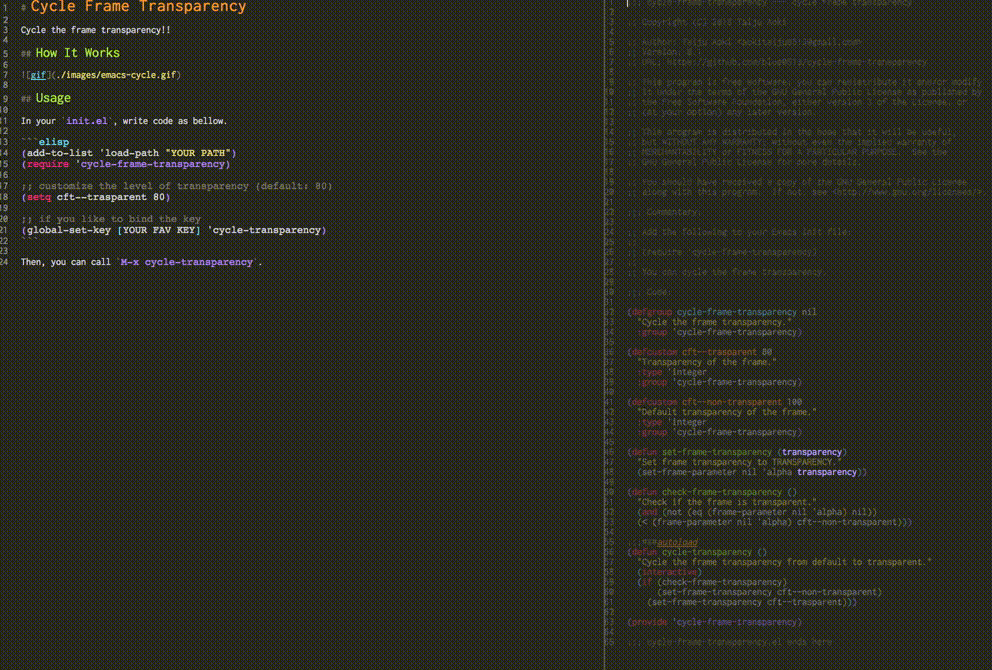

# Cycle Flame Transparency

Cycle the flame transparency!!

## How It Works



## Usage

In your `init.el`,

```elisp
(add-to-list 'load-path "YOUR PATH")
(require 'cycle-flame-transparency)

;; if you like to bind the key
(global-set-key [YOUR FAV KEY] 'cycle-transparency)
```
